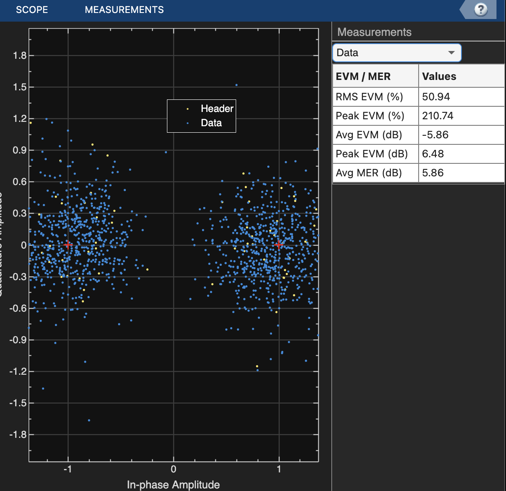

# Prova Finale SDC a.a. 2024-25
Progetto di Sistemi di Comunicazione dell'Anno Accademico 2024-2025, relativo a:
- simulazione e test OTA con SDR 'Adalm-Pluto' di un sistema OFDM con diverse codifiche di canale
- sviluppo di un sistema AMC (adaptive modulation and coding) con l'ausilio di un algoritmo di ML (machine learning) atto a classificare lo stato della     
  comunicazione.
  
Gli autori del progetto sono:
- Nicola Gallucci - nicola.gallucci@mail.polimi.it
- Matteo Malagrinò - matteo.malagrino@mail.polimi.it

## Indice
- [Introduzione](#introduzione)
- [Sistema OFDM](#sistema-ofdm)
  - [Introduzione agli esperimenti](introduzione-agli-esperimenti)
  - [Parametri di trasmissione](#parametri-di-trasmissione)
  - [Stima di BER e SNR](#stima-di-ber-e-snr)
  - [Risultati delle simulazioni](#risultati-delle-simulazioni)
  - [Risultati dei test OTA](risultati-dei-test-ota)
  - [Codice Matlab](codice-matlab-ofdm)
- [Sistema AMC](#amc)
  - [Introduzione al sistema](#introduzione-al-sistema)
  - [Descrizione del classificatore](#descrizione-del-classificatore)
    - [Generazione dei dati di training](#generazione-dei-dati-di-training)
    - [Training e accuracy del modello](#training-e-accuracy-del-modello)
  - [Test OTA](#test-ota)
  - [Codice Matlab](#codice-matlab-amc)   
- [Conclusioni](#conclusioni)

# Introduzione

La crescente diffusione delle reti di comunicazione wireless avanzate richiede sistemi sempre più efficienti e adattabili alle condizioni variabili del canale. Questa tesi si concentra sulla simulazione e la validazione **Over-The-Air (OTA)** di un sistema di comunicazione basato su **OFDM (Orthogonal Frequency Division Multiplexing)** utilizzando **SDR (Software-Defined Radio) Adalm-Pluto**. L’obiettivo principale è implementare e testare un sistema di **Adaptive Modulation and Coding (AMC)** che ottimizza la trasmissione in base alle condizioni del canale.

In una prima fase, vengono effettuati test su un sistema **OFDM base**, sia in assenza che in presenza di **codifica di canale**, valutando le prestazioni attraverso simulazioni e test **OTA**. Successivamente, per classificare lo stato della comunicazione e adattare dinamicamente i parametri di modulazione e codifica, viene sviluppato un modello di **Machine Learning (ML)**. Tale modello analizza parametri chiave come **SNR stimato, BER e risposta all’impulso del canale**, permettendo di selezionare la configurazione ottimale per massimizzare l'affidabilità e l’efficienza spettrale del sistema.

La validazione sperimentale avviene tramite test **OTA (Over The Air)** in ambienti controllati, valutando le prestazioni del sistema in presenza di **interferenze, fading e effetto Doppler**, tipici di scenari dinamici. I risultati ottenuti dimostrano l'efficacia dell'approccio proposto, evidenziando il ruolo cruciale dell'**intelligenza artificiale** nell’ottimizzazione adattiva delle comunicazioni wireless.

# SISTEMA OFDM
## Introduzione agli esperimenti
Per valutare il sistema in maniera completa ed efficace si è avuta la necessità di testarlo in ambienti e in situazioni differenti, così da poter confrontare i risultati e avere un quadro preciso rispetto a quelle che sono le reali prestazioni del sistema di comunicazione.

I dati raccolti, come si vedrà in dettaglio successivamente, sono stati ottenuti in due modi:

- **Simulazione del sistema**: il sistema è stato simulato in maniera del tutto virtuale attraverso il software MATLAB nel quale sono stati utilizzati gli stessi parametri del sistema reale. Le simulazioni sono state eseguite variando opportunamente le caratteristiche per adattarle alle casistiche successivamente applicate nella realtà. 
  > *Il riferimento al codice, simulato e non, è disponibile in versione integrale nella cartella 

- **Testing del sistema reale**: attraverso l'utilizzo di *Software Defined Radio* ADALM-PLUTO e il software MATLAB si è stati in grado di programmare le SDR in modo tale da trasmettere e ricevere correttamente un segnale di testo, utilizzando una modulazione OFDM in vari ambienti e con parametri editabili direttamente dall'interfaccia utente.

Al termine della fase di testing, con i dati raccolti si è stati in grado di valutare analiticamente le prestazioni del sistema, prendendo come riferimenti i tradizionali parametri di valutazione delle performance nelle telecomunicazioni come il **BER** (*Bit Error Rate*) e l'**SNR** (*Signal-to-Noise Ratio*).

## Parametri di trasmissione

La modulazione OFDM è stata implementata nel sistema di comunicazione tramite l'utilizzo del software MATLAB, nel quale è stato possibile realizzare e simulare un sistema OFDM reale definendo i parametri caratteristici e programmando trasmettitore e ricevitore sulla base di essi.

I parametri, editabili direttamente sull'interfaccia del trasmettitore e del ricevitore, sono:

- **FFT Length**: definisce la lunghezza della Fast Fourier Transform.
- **Cycle Prefix Length**: definisce la lunghezza del Cycle Prefix (*Il Cycle Prefix determina il tempo di guardia in un sistema multiportante che utilizza FFT/IFFT*).
- **Number of Subcarriers**: definisce il numero di sottoportanti ortogonali utilizzati nella modulazione.
- **Subcarrier Spacing**: indica la banda di ogni sottoportante.
- **Pilot Subcarrier Spacing**: indica la banda della sottoportante pilota o principale (*Le sottoportanti pilota vengono utilizzate allo scopo di compensare gli offset di frequenza e di fase nel ricevitore*).
- **Channel Bandwidth**: larghezza di banda del canale.

In questo modo si riesce a generare una forma d'onda con modulazione OFDM da trasmettere, definita come:

<p align="center">
  
</p>
<p align = "center">
Fig.1 - Tabella OFDM
</p>

### Legenda delle sigle utilizzate

| **Sigla** | **Descrizione** |
|----------|---------------|
| **SS: Synchronization Symbol** | Un segnale di sincronizzazione (sync) viene trasmesso come primo simbolo nel frame. Il segnale di sincronizzazione è costituito da un segnale a 62 sottoportanti centrato su DC generato utilizzando uno ZadOff-Chu. Questo segnale è progettato per essere indipendente dalla larghezza di banda. |
| **RF: Reference Symbol** | Il simbolo successivo nel frame di trasmissione è il simbolo di riferimento. Noto sia al trasmettitore che al ricevitore, il simbolo di riferimento consente al ricevitore di confrontare il simbolo di riferimento ricevuto con il simbolo di riferimento noto per stimare il canale. |
| **HS: Header Symbol** | Il simbolo di header trasmette la larghezza di banda, lo schema di modulazione della sottoportante e la velocità di codifica dei simboli di dati OFDM per aiutare il ricevitore a decodificare il frame trasmesso. Le informazioni sono abbastanza importanti da essere trasmesse con ampi margini di segnalazione e codifica per massimizzare la decodifica corretta. |
| **PS: Pilot Signals** | Utilizzato per combattere il jitter di fase osservato a frequenze di trasmissione più elevate. Un pilot viene trasmesso a intervalli di sottoportante fissi all'interno dei simboli di dati per fornire un riferimento di fase al ricevitore. |
| **DC and Guard Subcarriers** | Le sottoportanti nulle al limite dello spettro di trasmissione vengono utilizzate per limitare l'energia spettrale a una larghezza di banda specificata. Anche la sottoportante in DC viene annullata per mantenere l'energia del segnale entro l'intervallo lineare dell'amplificatore di potenza. |


I parametri standard della trasmissione e della ricezione per i test OTA considerati sono:

| **Parametri** | **Valore** |
|--------------|-----------|
| FFT | 128 |
| Cycle Prefix | 32 |
| Number of Subcarriers | 72 |
| Subcarrier spacing | 30 kHz |
| Pilot Subcarrier spacing | 9 |
| Bandwidth | 3 MHz |
| Carrier Frequency | 865 MHz |
| Gain Tx | [-10, -5, 0] |
| Gain Rx | [40, 60, 70] |

La forma d'onda oggetto della trasmissione tra dispositivi, che trasporta l'informazione di testo, è una forma d'onda a coseno rialzato del tipo:
<p align="center">
  
</p>
<p align = "center">
Fig.2 - Forma d'onda trasmessa
</p>

---

## Stima di BER e SNR

Per valutare il sistema è stato necessario calcolare i suddetti parametri, i quali sono stati ricavati in modo tale da approssimare al meglio il valore reale.

Nel calcolo del BER, al ricevitore è nota la stringa di testo da ricevere (*stringa attesa*) e questo consente di confrontarla con la stringa ricevuta attraverso la funzione MATLAB `comm.errorRate(tx,rx)`, determinando il numero di bit effettivamente errati e ottenendo il valore del parametro.

Per quanto riguarda invece il calcolo dell'SNR, l'approssimazione utilizzata prevede di mediare i valori di potenza ottenuti tramite la densità spettrale di potenza del segnale ricevuto, all'interno della banda di interesse (tra -100MHz e 100MHz), così da ottenere la **potenza media del segnale utile**.

Successivamente si procede selezionando un punto al di fuori della banda (circa 129MHz) in cui non è presente il segnale utile così da catturare la **potenza di rumore**, necessaria per determinare il valore finale.

Per ottenere il valore approssimato di SNR si procede sottraendo alla potenza di segnale utile quella di rumore (poiché i dati raccolti sono in dBm).

## Risultati delle simulazioni
La prima fase consiste nel simulare tutti i contesti di trasmissione di interesse, per avere un quadro di riferimento sul quale basare le misurazioni reali.

Nelle immagini riportate di seguito (Figura 3.2) sono state simulate virtualmente le curve di **BER vs SNR** e confrontate con la **curva teorica**, considerando la presenza e non della codifica di canale e dei diversi code rate:

<p align="center">
  
  
</p>

<p align="center">
  
  
</p>
<p align = "center">
Fig.3-4-5-6 - Forme d'onda delle modulazioni (da in alto a sx a in basso a dx) rispettivamente di BPSK, QPSK, 16-QAM, 64-QAM
</p>

Da questi risultati, a priori, si può notare che la presenza del canale e di conseguenza del rumore, distorce i risultati rispetto alla curva teorica, che rappresenta il caso ideale.

## Risultati dei test OTA
Sotto la guida di questi risultati è possibile procedere con le misurazioni reali, attraverso i dispositivi SDR, per valutare concretamente quali siano gli effetti della trasmissione quando l'onda viene propagata in spazio libero, immersa in continui stimoli di rumore ed interferenze di vario genere.

Quello che accade nel sistema reale diventa ancora più chiaro guardando il segnale ricevuto, le costellazioni ottenute per ogni ambiente e i valori delle misurazioni in contesti differenti:

| Modulazione | Code-Rate | BER | SNR | Codifica di canale | Distanza |
|-------------|-----------|------|------|--------------------|----------|
| BPSK | 1/2 | 0 | 11 | SI | 5m |
| BPSK | 2/3 | 0 | 9 | SI | 5m |
| BPSK | 3/4 | 1.9×10⁻³ | 12.6 | SI | 5m |
| QPSK | 1/2 | 0 | 10.3 | SI | 5m |
| QPSK | 2/3 | 0 | 11.6 | SI | 5m |
| QPSK | 3/4 | 0 | 12.9 | SI | 5m |
| 16-QAM | 1/2 | 2×10⁻² | 10 | SI | 5m |
| 16-QAM | 2/3 | 6.3×10⁻³ | 11 | SI | 5m |
| 16-QAM | 3/4 | 1.6×10⁻² | 12 | SI | 5m |
| 64-QAM | 1/2 | 5×10⁻³ | 12.6 | SI | 5m |
| 64-QAM | 2/3 | 3×10⁻¹ | 10.8 | SI | 5m |
| 64-QAM | 3/4 | 1.88×10⁻¹ | 11.5 | SI | 5m |
| BPSK | - | 0 | 19.8 | NO | 5m |
| QPSK | - | 0 | 19.9 | NO | 5m |
| 16-QAM | - | 1.13×10⁻¹ | 18 | NO | 5m |
| 64-QAM | - | 4.8×10⁻¹ | 20 | NO | 5m |
| QPSK | 1/2 | 5.2679×10⁻⁵ (*) | 11 | SI | 20m |
| QPSK | 1/2 | 4.587×10⁻² (*) | 8 | SI | 20m (**) |
| QPSK | 1/2 | 0 | 15.9 | SI | 60cm (**) |
| QPSK | 1/2 | 0 | 17 | SI | 1.20m (**) |

(*) *Massimo gain in ricezione pari a 72 e in trasmissione pari a -3*

*(**) Presenza di un ostacolo durante la trasmissione*


Si osserva che modulazioni più robuste con codifiche più ridondanti risultano avere performance migliori con BER minori. 

<p align="center">
  
  
</p>

<p align="center">
  
  
</p>
<p align = "center">
Fig.3-4-5-6 - Forme d'onda delle modulazioni (da in alto a sx a in basso a dx) rispettivamente di BPSK, QPSK, 16-QAM, 64-QAM
</p>

<p align="center">
  
  
</p>

<p align="center">
  
  
</p>
<p align = "center">
Fig.7-8-9-10 - Costellazioni (da in alto a sx a in basso a dx) rispettivamente di BPSK, QPSK, 16-QAM, 64-QAM
</p>

## Codice Matlab OFDM
Per utilizzare il codice delle simulazioni scegliere uno tra i file [OFDMEndToEndCodifica.mlx](OFDM_simulato/OFDMConTutteCodifiche/OFDMEndToEndCodifica.mlx) e [OFDMEndToEndNoCodifica.mlx](OFDM_simulato/OFDMSenzaCodifiche/OFDMEndToEndNoCodifica.mlx). E' possibile scegliere i parametri di trasmissione tra quelli proposti nel codice. Leggere attentamente i commenti all'interno dei codici. 

Per utilizzare il codice per le SDR con codifica si consiglia di utilizzare due dispositivi differenti a cui sono collegate due Adalm-Pluto. Nel caso si dovesse usare un solo dispositivo, accedere ai file [helperGetRadioTxObj.m](OFDM_OTA/plutoTxRxConCodifica/TransmitterCodifica/helperGetRadioTxObj.m) e [helperGetRadioRxObj.m](OFDM_OTA/plutoTxRxConCodifica/ReceiverCodifica/helperGetRadioRxObj.m) e modificare la seguente riga di codice sostituendo "usb:0" con "usb:1".
```Matlab
radio = sdrrx('Pluto','RadioID','usb:0');
```
Per utilizzare il codice per le SDR senza codifica si segua lo stesso procedimento ma per i file [helperGetRadioTxObj.m](OFDM_OTA/plutoTxRxSenzaCodifica/NoCodificaTransmitter/helperGetRadioTxObj.m) e [helperGetRadioRxObj.m](OFDM_OTA/plutoTxRxSenzaCodifica/NoCodificaReceiver/helperGetRadioRxObj.m)
Tutti i file presentano una descrizione dettagliata delle loro funzionalità. Consultare i commenti presenti in ogni file per approfondire la loro utilità.

Si supponga di utilizzare due dispositivi. Sul primo dispositivo eseguire il codice di *TransmitterCodifica* e sul secondo dispositivo, invece, eseguire il codice per *ReceiverCodifica* con i comandi:
```
>> run CodificaTx.mlx
>> run CodificaRx.mlx
```
Assicurarsi di essere prima nelle cartelle giuste. Lo stesso discorso è estendibile anche per i test senza codifica.

Nel caso si volessero cambiare i parametri di trasmissione, modificare a proprio piacimento i **parametri vari e dati (NON modificare quelli relativi al OFDM)** nei file del trasmettitore e del ricevitore.

# AMC

## Introduzione al sistema

La crescente esigenza di sistemi di comunicazione wireless ad alte prestazioni ha portato allo sviluppo di tecniche avanzate come l'**Adaptive Modulation and Coding (AMC)**. L'AMC è una strategia che consente di ottimizzare la trasmissione dei dati in funzione delle condizioni variabili del canale di comunicazione, migliorando così l'efficienza spettrale e la robustezza del sistema. In questa sezione, esploreremo i fondamenti teorici dell'AMC, il ruolo cruciale di un **classifier** basato su algoritmi di **Machine Learning (ML)**, e i risultati ottenuti attraverso l'implementazione pratica con le schede SDR **Adalm-Pluto**.

L'AMC si basa sulla selezione dinamica di diverse configurazioni di modulazione e codifica per adattarsi in tempo reale alle condizioni del canale, come la **SNR (Signal-to-Noise Ratio)** e il **BER (Bit Error Rate)**. A seconda della qualità del canale, vengono utilizzati schemi di modulazione ad alta efficienza, come **QAM (Quadrature Amplitude Modulation)** e **PSK (Phase Shift Keying)**, insieme a diversi tassi di codifica per ottimizzare l'affidabilità e la velocità di trasmissione.

Un aspetto fondamentale nell'implementazione dell'AMC è la capacità di monitorare e classificare lo stato del canale in tempo reale. Per questo motivo, in questo lavoro, è stato scelto di utilizzare un **Support Vector Machine (SVM)**, un algoritmo di **Machine Learning** che permette di classificare efficacemente il canale in base ai parametri osservati, come la **SNR** e il **BER**. L'SVM è un metodo di apprendimento supervisionato particolarmente adatto a scenari con elevata dimensionalità, come quelli che caratterizzano i sistemi di comunicazione.

Successivamente, verrà illustrato l'algoritmo scelto per la trasmissione dei dati, che combina la modulazione adattativa con la codifica di canale, e come l'SVM viene integrato per ottimizzare dinamicamente la configurazione di modulazione e codifica. Infine, presenteremo i risultati degli esperimenti condotti utilizzando le schede **Adalm-Pluto**, che hanno permesso di testare l'implementazione dell'AMC in scenari reali di comunicazione, valutando le prestazioni del sistema in presenza di interferenze, fading e altre condizioni dinamiche del canale.

I risultati ottenuti dimostrano l'efficacia dell'approccio proposto, evidenziando come l'uso combinato dell'AMC e dell'apprendimento automatico possa migliorare significativamente le prestazioni dei sistemi di comunicazione wireless in ambienti complessi e variabili.

## Descrizione del classificatore
Il classificatore SVM utilizza un insieme di caratteristiche estratte dal segnale ricevuto per determinare lo stato della comunicazione. In particolare, gli ingressi del modello includono:

- **SNR stimato**: Indice del rapporto segnale-rumore.
- **BER (Bit Error Rate)**: Indicatore della qualità della decodifica.

L'uscita del classificatore è un punteggio discreto compreso tra 0 e 2, che rappresenta lo stato della comunicazione e determina la configurazione ottimale di modulazione e codifica.

Di seguito sono riportati i parametri associati ai vari casi di classificazione della comunicazione (modulazione - code rate):

- **0 - Comunicazione Pessima**: QPSK, 1/2
- **1 - Comunicazione Discreta**: 16-QAM, 2/3
- **2 - Comunicazione Ottima**: 64-QAM, 3/4

  
### Generazione dei dati di training
Per addestrare il modello SVM, è stata utilizzata una simulazione del sistema OFDM in cui sono stati variati in modo casuale diversi parametri:

- **SNR ricevuto**: da 0 a 25 dB.
- **Modulazione**: BPSK, QPSK, 16-QAM, 64-QAM.
- **Code rate**: 1/2, 2/3, 3/4.
- **Velocità del ricevitore**: da 0 a 3 km/h.
- **CFO (Carrier Frequency Offset)**: da 0 a 3 ppm.

I risultati ottenuti dalla simulazione sono stati salvati in un file CSV e etichettati per la classificazione in tre classi:

- **Classe 2**: se SNR ≥ 18 dB e BER < 10⁻².
- **Classe 1**: se 8 < SNR < 18 dB e 10⁻² ≤ BER < 8 × 10⁻², oppure se SNR ≥ 18 dB e BER > 10⁻².
- **Classe 0**: in tutti gli altri casi.

Il dataset finale contiene circa 13.000 campioni, suddivisi in training e test set per ottimizzare le prestazioni del modello SVM.

### Training e accuracy del modello
Il modello SVM è stato addestrato utilizzando un kernel **RBF** con parametri ottimizzati tramite *Grid Search*. Le metriche di valutazione del modello includono:

<p align="center">
  
</p>

Di seguito viene riportata la matrice di confusione del modello:

<p align="center">
  
</p>

## Test OTA

Il classificatore è stato integrato nel ricevitore OFDM, il quale, dopo aver stimato i parametri del canale, utilizza il modello SVM per determinare lo stato della comunicazione. In base alla decisione del classificatore, il trasmettitore adatta la modulazione e il code rate, garantendo un equilibrio tra efficienza spettrale e robustezza della trasmissione. Nel seguito saranno analizzati i risultati ottenuti dall’esperimento del sistema AMC attuato con l’ausilio di due SDR "Adalm-Pluto" che fungono da trasmettitore e ricevitore.
Si consideri il trasmettitore come Dispositivo 1 e il ricevitore, con il classificatore SVM, come Dispositivo 2.
I risultati sperimentali mostrano che l’implementazione dell’AMC basato su SVM migliora significativamente le prestazioni del sistema in scenari con variazioni rapide delle condizioni del canale. La comunicazione comincia sempre utilizzando una 64-QAM con un tasso di codifica di 3/4 per aumentare l’efficienza di trasmissione. Tuttavia, come si può osservare dai grafici, nel caso dell’esperimento la trasmissione appariva molto disturbata e le performance di trasmissione erano pessime (BER molto elevato).

<p align="center">
  
  
</p>
<p align = "center">
Fig.11-12 - Risultati rispettivamente della prima e seconda ricezione
</p>


Il classificatore ha restituito 0 (comunicazione pessima), quindi il messaggio di feedback inviato sarà 0000. PEr l’invio del feedback si scelgono code rate e modulazioni robuste quali BPSK e 1/2. Il trasmettitore, una volta ricevuto il feedback, cambia i propri parametri di trasmissione. Nelle figure sottostanti è possibile osservare le modulazioni ricevute nei due casi.

<p align="center">
  
  
</p>
<p align = "center">
Fig.13-14 - Costellazioni ricevute rispettivamente alla prima e seconda trasmissione
</p>

Il risultato della trasmissione è indicato nella figura 2. Il trasmettitore quindi sceglie la coppia 16-QAM 2/3 come nuovi parametri di trasmissione. In figura 5 è possibile osservare l’andamento dei parametri di trasmissione di Dispositivo 1 ai vari step di trasmissione.

<p align="center">
  
</p>
<p align = "center">
Fig.15 - Code Rate e Modulation order nel tempo
</p>

## Codice Matlab AMC
Per utilizzare il codice si consiglia di utilizzare due dispositivi differenti a cui sono collegate due Adalm-Pluto. Nel caso si dovesse usare un solo dispositivo, accedere ai file [helperGetRadioTxObj.m](AMC/DISPOSITIVO2/TX_Disp2/helperGetRadioTxObj.m) e [helperGetRadioRxObj.m](AMC/DISPOSITIVO2/RX_Disp2/helperGetRadioRxObj.m) e modificare la seguente riga di codice sostituendo "usb:0" con "usb:1".
```Matlab
radio = sdrrx('Pluto','RadioID','usb:0');
```
Tutti i file presentano una descrizione dettagliata delle loro funzionalità. Consultare i commenti presenti in ogni file per approfondire la loro utilità.

Si supponga di utilizzare due dispositivi. Sul primo dispositivo eseguire il codice di DISPOSITIVO 1 e sul secondo dispositivo, invece, eseguire il codice per il secondo dispositivo (DISPOSITIVO 2) con i comandi:
```
>> run Dispositivo1.m
>> run Dispositivo2.m
```

Nel caso si volessero cambiare i parametri di trasmissione, modificare a proprio piacimento i **parametri vari e dati (NON modificare quelli relativi al OFDM)** nei file [helperSetParameters.m](AMC/DISPOSITIVO2/helperSetParameters.m) e [helperSetParameters.m](AMC/DISPOSITIVO1/helperSetParameters.m).

La cartella [MLmodel](AMC/DISPOSITIVO2/MLmodel) contiene i file utilizzati per la generazione dei dati di training, per la loro labelizzazione e l'addestramento del modello. Visionare il file [SVM.ipynb](AMC/DISPOSITIVO2/MLmodel/SVM.ipynb) per approfondire il training del modello SVM. 

# Conclusioni

Il lavoro svolto in questa tesi ha dimostrato l'efficacia di un sistema di comunicazione basato su **OFDM** con **Adaptive Modulation and Coding (AMC)**, ottimizzato tramite tecniche di **Machine Learning** e validato in condizioni reali tramite test **Over-The-Air (OTA)** con **SDR Adalm-Pluto**. L'integrazione di un modello ML per la classificazione dello stato del canale ha permesso di adattare dinamicamente i parametri di trasmissione, migliorando l'affidabilità e l'efficienza spettrale del sistema.

Prima di implementare il sistema AMC, sono stati condotti test approfonditi sul sistema **OFDM base**, sia in simulazione che in ambiente reale tramite prove OTA, valutando le prestazioni in assenza e in presenza di codifica di canale. I risultati hanno evidenziato come la **codifica di canale** migliori significativamente la resilienza alle interferenze e alle degradazioni del canale, riducendo il **BER (Bit Error Rate)** rispetto alla configurazione senza codifica. Tuttavia, senza un meccanismo adattivo, il sistema non è in grado di rispondere dinamicamente alle variazioni delle condizioni di propagazione, portando a inefficienze o degrado delle prestazioni in scenari complessi.

I risultati sperimentali hanno confermato che l'uso di **tecniche adattive** consente di mitigare gli effetti delle variazioni del canale, come interferenze, fading e effetto Doppler, rendendo il sistema più robusto rispetto a una configurazione statica. In particolare, la capacità del modello di apprendere le condizioni del canale e selezionare la modulazione e il code rate più appropriati rappresenta un passo avanti verso l'ottimizzazione autonoma delle reti wireless.

Questa ricerca apre la strada a future applicazioni in scenari reali, come **le reti 5G**, dove l'adattabilità del sistema alle condizioni variabili del canale è fondamentale. Ulteriori sviluppi potrebbero includere l'integrazione con tecniche avanzate di **Deep Learning** e l'estensione del sistema a scenari multi-utente e multi-antenna (**MIMO**), migliorando ulteriormente la capacità di adattamento alle dinamiche del canale.

  

